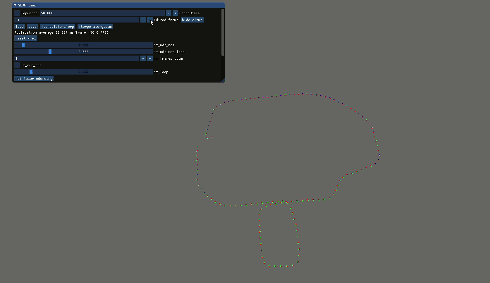
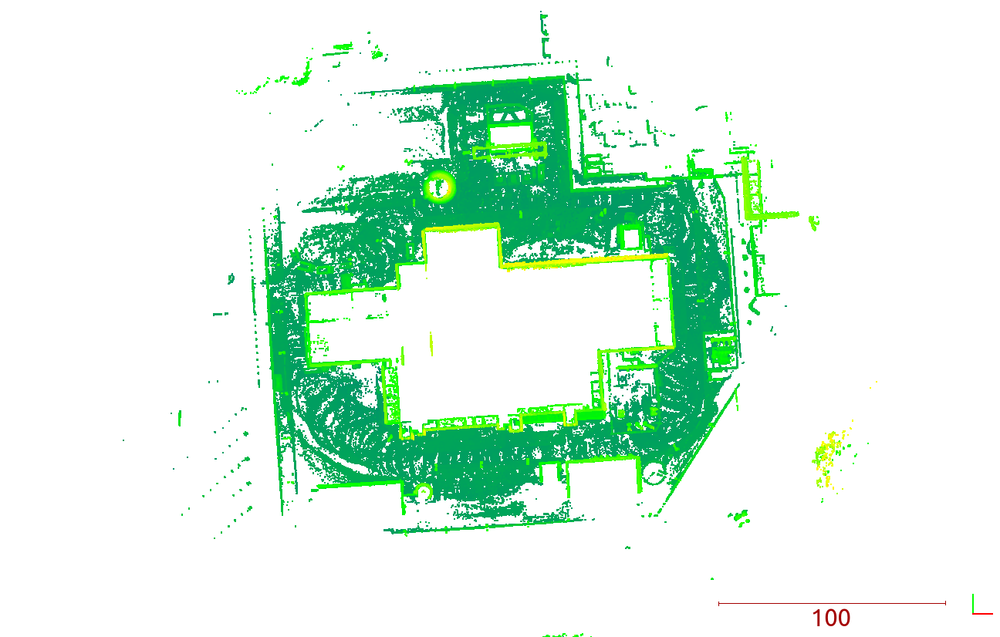
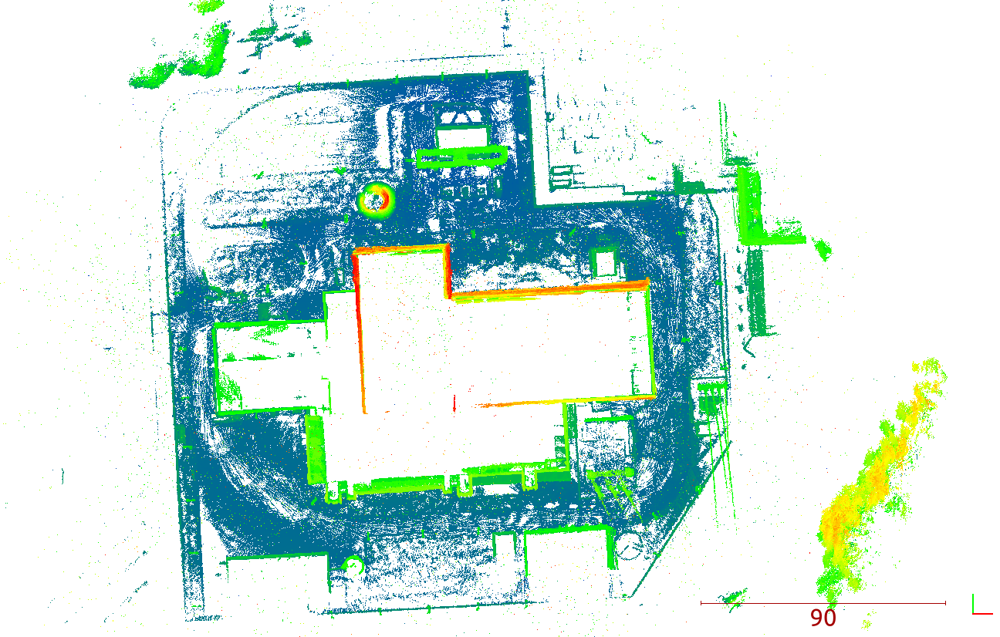
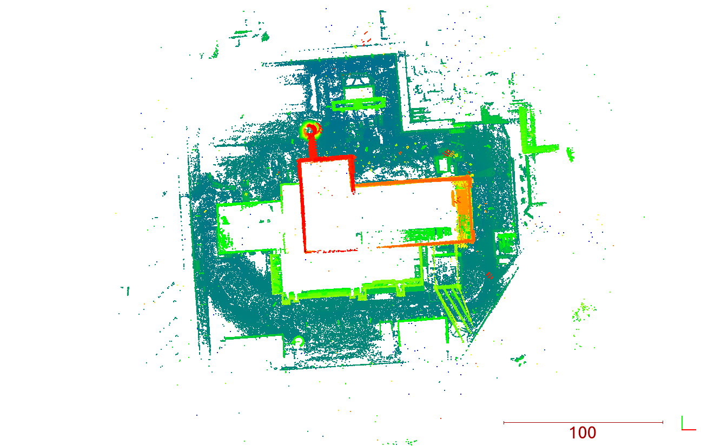

# Tool to register data using NDT and GTSAM.

# Dependencies
### GTSAM

GTSAM need to build from source (58d4c05f) with following params:
```
GTSAM_USE_SYSTEM_EIGEN:BOOL=ON
GTSAM_BUILD_WITH_MARCH_NATIVE:BOOL=OFF
```
### Ceres
Build / or install from APT

### PCL
Build / or install from APT


# Screenshot 


# Sample data
Data contains exported odometry and pointcloud from mobile mapping system.
We provide 'json' with calibration. To open it, hit 'load' after opening tool.
## Scan with VLP16
```
https://storage.googleapis.com/dataset_sensors_pub/npp/velodyne_planar.tar.xz
```

```bash
slamGL --dataset "velodyne_planar/*.pcd" --json /velodyne_planar/config.json --laser_offset 180 --skip 1
```

## Scan with Livox Mid-40

Link to data:
```
https://storage.googleapis.com/dataset_sensors_pub/npp/livox_mirror.tar.xz
```
Recommended command:
```bash
./slamGL --dataset "livox_mirror/*.pcd" --json livox_mirror/config.json --laser_offset 180 --skip 1
```


More info about system and its calibration : https://github.com/michalpelka/lidar_spinning_mirror
## Scan with rotated VLP16
Link to data:
```
https://storage.googleapis.com/dataset_sensors_pub/velodyne_rot.tar.xz
```

Recommended command:
```bash
./slamGL --dataset "velodyne_rot/*.pcd" --json velodyne_rot/config.json --laser_offset 180 --skip 4
```



