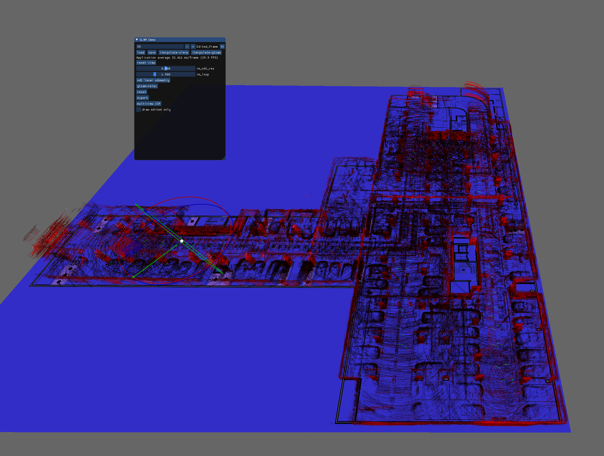

# Tool to register data using NDT and GTSAM.


# Dependencies
### GTSAM

GTSAM need to build from source (58d4c05f) with following params:
```
GTSAM_USE_SYSTEM_EIGEN:BOOL=ON
GTSAM_BUILD_WITH_MARCH_NATIVE:BOOL=OFF
```
### Ceres
Build / or install from APT

### PCL
Build / or install from APT


# Screenshot 

